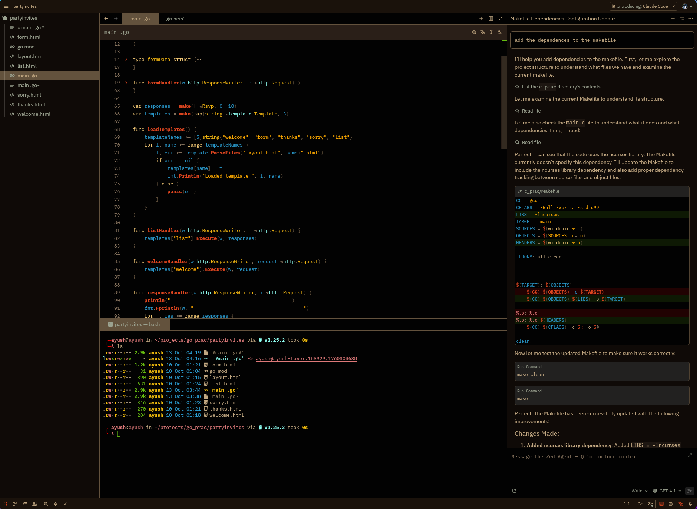
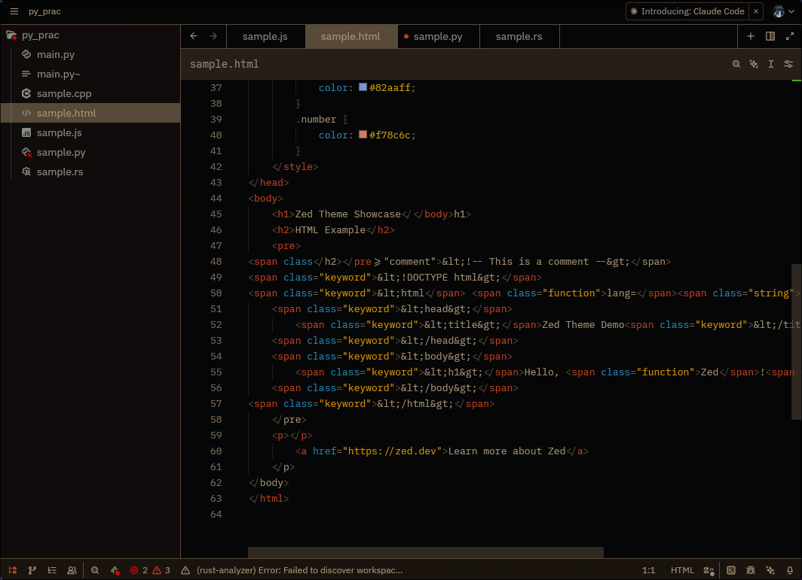
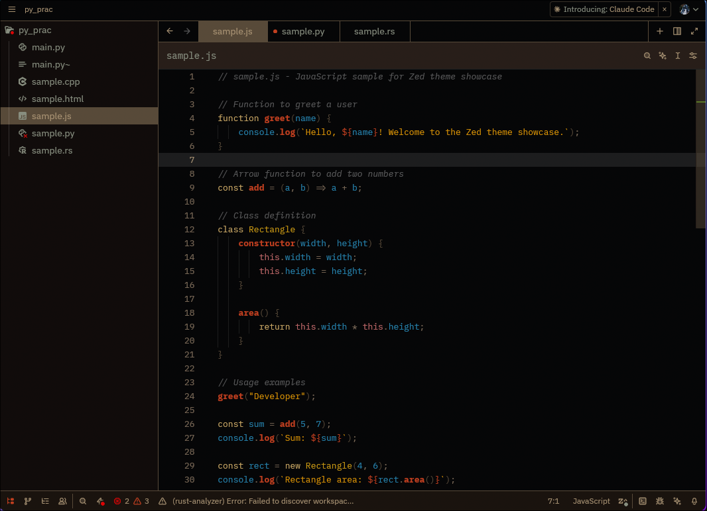
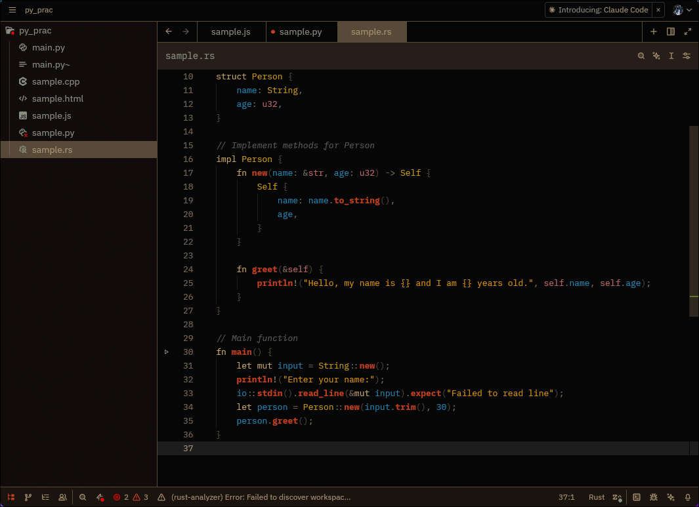
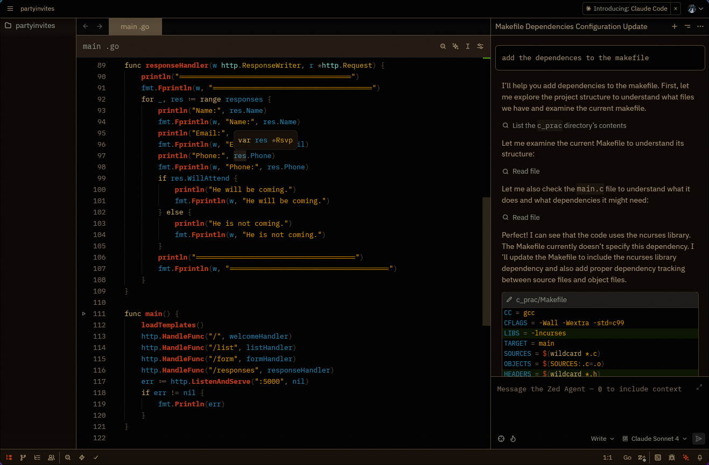
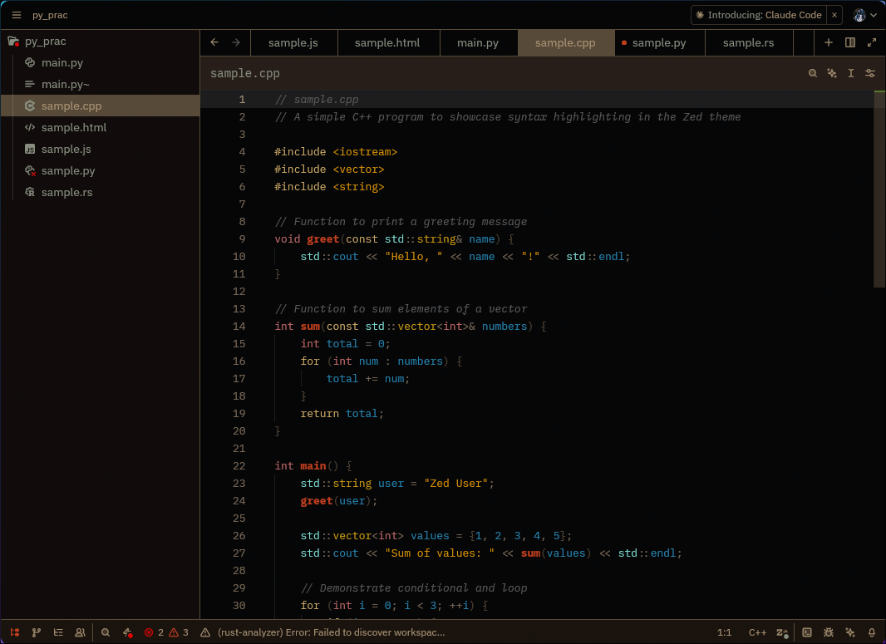

# Fleury Theme for Zed

A warm, rusty theme inspired by bronze and copper tones, based on the original Emacs Fleury theme. This theme brings the weathered metal aesthetic to Zed with excellent contrast and readability.

## Features

🔥 **Warm Rust Palette** - Bronze, copper, and rust tones create a cozy coding environment
⚡ **Excellent Contrast** - All text is highly readable with proper contrast ratios
🎨 **Complete Coverage** - Consistent styling across all UI elements and syntax
👁️ **Eye-Friendly** - Perfect for long coding sessions without strain
🌅 **Rusty Aesthetic** - Inspired by weathered metal and aged bronze

## Color Palette

- **Rich Bronze** (#c2a882) - Main text and code
- **Rust Brown** (#8a7660) - Comments and subtle elements
- **Coffee Brown** (#63523d) - Borders and selections
- **Burnt Orange** (#de451f) - Functions and accents
- **Amber Gold** (#fcaa05) - Keywords and highlights
- **Sky Blue** (#2895c7) - Variables and constants
- **Fresh Green** (#66bc11) - Cursor and success states

## Screenshots

### General UI

### HTML

### JavaScript

### Python

### Rust

### Go

### C++

## Installation

### From Zed Extensions (Recommended)
1. Open Zed
2. Open the command palette (`Cmd+Shift+P` or `Ctrl+Shift+P`)
3. Run "zed: Extensions"
4. Search for "Fleury"
5. Click Install
6. Select the theme from Theme Selector (`Cmd+K Cmd+T`)

### Manual Installation
1. Download `fleury.json`
2. Place it in `~/.config/zed/themes/fleury.json`
3. Restart Zed
4. Select "Fleury Dark" from Theme Selector

## Credits

Created by **Ayush Bhat**, inspired by the original [Emacs Fleury theme](https://github.com/ShamsParvezArka/fleury-theme.el) by Shams Parvez Arka.

## License

MIT License - Feel free to modify and share!

---

*"Coming up with an original idea in 21st century is tough, even my dreams aren't original anymore!" - Original Fleury theme motto*
